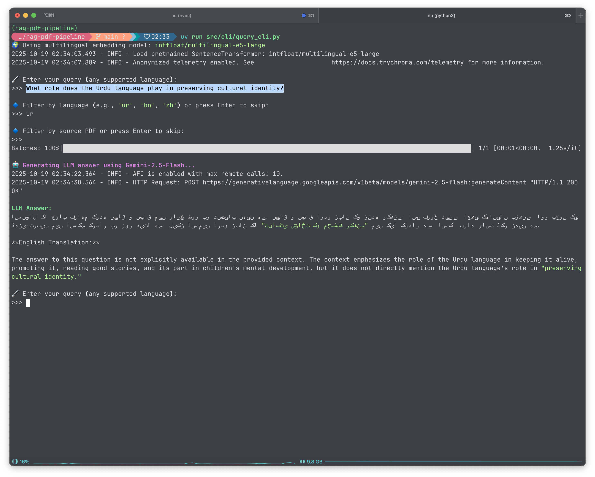

# 📚 RAG PDF Pipeline with Multilingual Support & Chat Memory

## 📝 Overview

This project implements a **Retrieval-Augmented Generation (RAG)** system capable of performing **question answering over PDF documents** in multiple languages (English, Chinese, Urdu, Bengali, etc.).

The system integrates advanced features like **chat memory, query decomposition, hybrid search, metadata filtering, and LLM-based answer generation**, with persistent memory for conversation history and optimized embeddings for multilingual semantic search.

---



---

## 🚀 Features Implemented

| Feature                                      | Description                                                                                                                              |
| -------------------------------------------- | ---------------------------------------------------------------------------------------------------------------------------------------- |
| 🧠 **Chat Memory**                           | Maintains conversation history using **SQLite-backed LangGraph memory**. Summarizes older interactions while keeping recent ones intact. |
| 🛠️ **Query Decomposition**                   | Breaks complex queries into sub-queries to improve retrieval relevance.                                                                  |
| ✂️ **Optimized Chunking**                    | Splits PDF content into semantic chunks. Stores metadata like `chunk_index`, `language`, and `source_pdf`.                               |
| 🔍 **Hybrid Retrieval & Metadata Filtering** | Combines embedding-based semantic search with metadata filters for language or source PDF.                                               |
| 🤖 **LLM Integration**                       | Uses **Gemini-2.5-Flash** to generate multilingual answers with translations to English.                                                 |
| 💾 **Persistent Memory Storage**             | Stores conversation states in **SQLite**, surviving across sessions.                                                                     |
| 🌐 **Multilingual Embeddings**               | Uses `intfloat/multilingual-e5-large` to support semantic search in English, Chinese, Urdu, Bengali, etc.                                |

---

## ⚙️ System Requirements & Project Setup Instructions

- **Python >= 3.12**
- **Git**

- **System-level Dependencies**: **Tesseract OCR** (required for `pytesseract` during PDF parsing)

```bash
sudo apt install tesseract-ocr
# OR
brew install tesseract-ocr
# OR to install all languages such as urdu, bengali
brew install tesseract --all-languages
```

- **uv**

```bash
# Install uv via pip:
pip install uv
# OR via curl (faster on Linux/macOS):
curl -LsSf https://astral.sh/uv/install.sh | sh
```

---

#### Step 1: Clone the Repository

```bash
git clone git@github.com:Now-Tiger/rag-pdf-pipeline.git
cd rag-pdf-pipeline
```

#### Step 2: Create and Activate the Environment

```bash
uv venv
uv sync
```

#### Activate the Environment

```bash
# macos
source .venv/bin/activate
```

#### Step 3: Configure Gemini API Key

1. Get your API Key from Google AI Studio [click here](https://aistudio.google.com/app/api-keys).
2. Set the Environment Variable:

```bash
# macos or set the same key-val pair in .env file refer .env.example file
export GEMINI_API_KEY='YOUR_API_KEY_HERE'
```

---

## 🖥️ Run application

1. **Run** `main.py` **file first**.

```bash
python3 main.py
```

2. **Run the CLI**

```bash
python3 src/cli/query_cli.py
```

2. Enter your query in any supported language.
   - **Open `data/chinese_example_queries.md` file and you can enter example queries from this markdown**.
   - For Urdu language you have `urdu_example_queries.md` present in the data folder.

3. Apply optional filters:
   - 🌐 Language (e.g., `ur`, `bn`, `zh`)
   - 📄 Source PDF

4. View retrieved chunks and LLM-generated answer.
5. Conversation history is automatically persisted in SQLite.

---

## ✅ Achieved Project Todos

| Todo                                  | Status       |
| ------------------------------------- | ------------ |
| 🧠 Chat memory functionality          | ✅ Completed |
| 🛠️ Query decomposition                | ✅ Completed |
| ✂️ Optimized chunking algorithms      | ✅ Completed |
| 🔍 Hybrid search (semantic + keyword) | ✅ Completed |
| 💾 Integration with vector database   | ✅ Completed |
| 🤖 LLM & embedding selection          | ✅ Completed |
| 🔝 Reranking algorithms               | ✅ Completed |
| 🌐 Metadata filtering                 | ✅ Completed |
| 💽 Persistent memory storage          | ✅ Completed |

---

## ⚠️ Limitations & Observations

- Some **Urdu/Bengali content** is occasionally misparsed due to PDF OCR limitations, affecting embedding quality.
- Chinese content is consistently parsed and stored without issues.
- Embedding and LLM pipelines perform well for English and Chinese, but low-quality OCR in Urdu/Bengali can reduce retrieval accuracy.

---

## 🔮 Future Enhancements

1. **Improved OCR**: Use commercial OCR tools like **Surya OCR** for better accuracy on Urdu/Bengali PDFs.
2. **Vector Database Scaling**: Upgrade to **Weaviate** or **Milvus** for large-scale datasets.
3. **Advanced Chunking**: Implement semantic-aware chunk merging for extremely long paragraphs.
4. **LLM Customization**: Fine-tune small LLMs on domain-specific PDFs to improve answer relevance.
5. **Multi-turn QA**: Extend chat memory to handle **contextual follow-up queries** across sessions.

---

## 🧑‍💻 Author

**Swapnil Narwade**<br>
_Backend Engineer & AI Developer_
🌐 [GitHub](https://github.com/Now-Tiger) • 🧠 [LinkedIn](https://www.linkedin.com/in/now-tiger)
